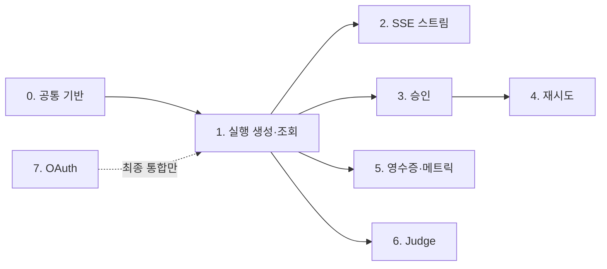

# BACKPLAN — 백엔드(A) 구현 단계 계획

> mock 라우트(`app/api/**`)를 실제 파이프라인으로 교체하는 단계별 계획. [API.md](API.md) 계약과 대조 검증 완료.

| 항목 | 내용 |
| --- | --- |
| 기준 문서 | [API.md](API.md), [PLAN.md](PLAN.md), [TRD.md](TRD.md) |
| 타입 원본 | `lib/contracts/schemas.ts` (zod) |

## 0. 현재 상태 요약

- `lib/` 코어(파이프라인·스토어·승인 토큰·Foundry·GitHub 클라이언트)는 완료, 라우트 9개는 전부 `app/api/_mock/fixtures.ts` 기반 mock.
- 확인된 엔진 갭: `lib/workflow/run-execution.ts`에 `startExecution`·`approveExecution`만 있고 **`retryNode` 없음** → 4단계에서 추가.
- `app/api/auth/**` 라우트는 미존재 → 7단계에서 신규 생성.

## 단계

### 0. 공통 기반 — `lib/api/` 헬퍼 (선행)

- **오류 응답 헬퍼**: API.md 1장 `{ error: { code, message } }` 형태 + 400/401/403/404/409 매핑 함수.
- **`getSessionUser()` 스텁**: 개발 중엔 고정 사용자 반환. 모든 보호 라우트가 처음부터 이걸 사용 → 7단계에서 스텁 내부만 세션 쿠키 구현으로 교체 (라우트 재작업 방지). 무인증 예외는 `judge`·`health`만.
- **WorkflowDeps 팩토리**: `getServerConfig()` + `getStore()` + `createFoundryClient` + `createGithubClient`를 조립하는 `createWorkflowDeps()` — 모든 라우트가 공유.
- **이벤트 버스 레지스트리**: executionId → `ExecutionEventBus` 맵 + 이벤트 히스토리 버퍼(늦은 접속 replay용). `createExecutionEventBus()`는 존재하나 라우트 간 공유 레지스트리가 없음.

### 1. 실행 생성·조회 (`feat/api-executions`)

- `POST /api/executions`: body zod 검증(`{ repoRef?, icsUrl? }`, 실패 시 400) → `startExecution()` 호출. **`created` 상태로 201 즉시 반환, 파이프라인은 백그라운드 진행** (fire-and-forget, `emitProgress`를 버스 레지스트리에 연결).
- `GET /api/executions/:id`: `store.getExecution(userId, id)` → 없거나 타 사용자 실행이면 404.

### 2. SSE 스트림 (`feat/api-sse-stream`)

- `ReadableStream`으로 `text/event-stream` 응답, 버스 구독 → `data: <JSON>\n\n`.
- API.md 3장 요건 3가지:
  1. 접속 직후 현재 상태 `stage_changed` 1건 선전송 (늦은 접속 동기화)
  2. 터미널 상태(`completed`/`failed`/`rejected`/`expired`) 도달 시 스트림 닫기 — `waiting_approval`은 유지
  3. 15초 간격 `: ping` keep-alive
- 라우트에 `export const dynamic = "force-dynamic"` 필요.

### 3. 승인 (`feat/api-approve`)

- `POST :id/approve`: body 검증(400) → 상태가 `waiting_approval` 아니면 **409** → blocked 노드 포함·해시 불일치·토큰 만료 시 **403 + 감사 로그** → `approveExecution()` 호출.
- **동기 완주**: API.md 2.2에 따라 실행·검증 완료 후 status `completed`인 `Execution`을 반환 (1단계의 fire-and-forget과 다른 패턴). 진행 중 `executing`/`verifying` 이벤트는 SSE로 병행 방출.
- 403 분기는 `verifyApprovalToken` + `selectBlockedNodeIds` 재사용.

### 4. 재시도 (`feat/api-retry`) ★ 엔진 작업 포함

- **`run-execution.ts`에 `retryNode()` 추가** (설계 누락분): `failed` 노드만 대상(아니면 409), 승인 토큰 TTL 만료 시 403, `createIdempotencyKey`로 중복 생성 방지, 성공 시 receipt 재발급.
- 라우트 응답: `{ executionId, nodeId, status }`.

### 5. 영수증·메트릭·헬스 (`feat/api-receipt-metrics`)

- `GET :id/receipt`: `execution.receipt` 없으면 404(영수증 미발급).
- `GET /api/metrics/daily?days=7`: `store.listMetricEvents` → `deriveDailyMetrics` 날짜별 집계, 미측정 값은 `null`.
- `GET /api/health`: 스토어 접근성 체크 수준으로 단순화. 무인증.

### 6. Judge Mode (`feat/api-judge`)

- `POST /api/judge`: `{ repoUrl }` 검증 → `startExecution({ mode: "judge", userId: "judge" })` → **동기로 완주 대기** 후 receipt 포함 최종 `Execution` 반환 (승인·SSE 불필요). 무인증.

### 7. GitHub OAuth (`feat/api-oauth`)

- 신규 라우트 4개: `GET /api/auth/login`(GitHub authorize 302) · `GET /api/auth/callback`(세션 쿠키 설정 후 `/` 302) · `POST /api/auth/logout`(204, 쿠키 삭제) · `GET /api/auth/me`(`{ userId, login }` / 401).
- 서명된 HttpOnly 세션 쿠키. 0단계 `getSessionUser()` 스텁 내부를 실제 세션 검증으로 교체하면 보호 라우트 전체에 401이 적용됨.

## 병렬 작업 맵

| 동시 진행 가능 | 이유 |
| --- | --- |
| 7 (OAuth) ∥ 전부 | 신규 디렉터리(`app/api/auth/`)라 파일 접점 0 — 0단계와도 동시 시작 가능 |
| 2 (SSE) ∥ 3 (승인) | 1단계 완료 후 서로 다른 라우트 파일 |
| 5 ∥ 6 ∥ (2, 3) | 1단계만 있으면 각각 독립 |
| 4는 3 이후 | 승인 토큰 검증 로직과 `retryNode` 엔진 변경이 3의 결과물에 의존 |

- **크리티컬 패스**: 0 → 1 → 2 → 3 (여기까지 완료 시 프론트(B)와 1차 통합·로컬 E2E 가능).
- **2명 분담 예시**: A1이 0→1→2→3→4, A2가 7→5→6.

## 구현 실행 방식 — 서브에이전트 병렬화 (필수)

구현 시 **반드시 서브에이전트를 사용해 독립 단계를 동시에 진행**한다. 순차 진행 금지 — 병렬 맵에서 의존성이 없는 단계는 전부 동시에 착수한다.

- **1차 병렬 배치**: 0단계(공통 기반) ∥ 7단계(OAuth) — 파일 접점이 없으므로 서브에이전트 2개 동시 실행.
- **2차 병렬 배치**: 0·1 완료 직후 2(SSE) ∥ 3(승인) ∥ 5(영수증·메트릭) ∥ 6(Judge) — 서브에이전트 최대 4개 동시 실행.
- **3차**: 4(재시도)만 3 완료 후 단독 실행.
- 각 서브에이전트에는 담당 단계의 라우트 파일 경로, 사용할 `lib/` 함수, API.md 해당 절, 응답 계약을 명시해 위임한다.
- 공유 파일(`lib/api/**`, `lib/contracts/schemas.ts`)은 0단계 서브에이전트만 수정한다 — 이후 배치의 충돌 방지.
- 각 배치 완료 시점에 `npx vitest run`으로 통합 검증 후 다음 배치를 시작한다.

### 스텝 내부 병렬화 (필수)

단계 사이뿐 아니라 **각 단계 안에서도 파일 단위로 독립적인 작업은 서브에이전트로 쪼개 동시에 실행**한다:

| 단계 | 내부 병렬 분할 |
| --- | --- |
| 0 | 오류 응답 헬퍼 ∥ `getSessionUser()` 스텁 ∥ WorkflowDeps 팩토리 ∥ 이벤트 버스 레지스트리 — 별도 파일 4개, 서브에이전트 4개 |
| 1 | `POST /api/executions` ∥ `GET /api/executions/:id` — 라우트 파일 2개 |
| 3 | approve 라우트 구현 ∥ 403·409 케이스 테스트 작성 |
| 4 | `retryNode()` 엔진 구현 ∥ retry 라우트·테스트 (엔진 시그니처를 먼저 합의 후 동시 진행) |
| 5 | receipt ∥ metrics/daily ∥ health — 라우트 파일 3개, 서브에이전트 3개 |
| 7 | login ∥ callback ∥ logout ∥ me — 라우트 파일 4개 (세션 쿠키 유틸만 선행 합의) |

- 분할 기준: **같은 파일을 두 서브에이전트가 수정하지 않는 것**. 공유 유틸이 필요하면 시그니처를 먼저 확정해 각 서브에이전트 프롬프트에 포함시킨다.
- 2(SSE)·6(Judge)은 단일 파일 작업이라 내부 분할 없이 단독 서브에이전트로 처리한다.

## 공통 규칙

- 각 단계는 [PLAN.md](PLAN.md) 3장 브랜치 규칙대로 하루 안에 merge할 크기 유지, merge 전 `npx vitest run` 통과 필수.
- mock 교체 시 응답 형태(`ExecutionProgressEventSchema` 등 schemas.ts 계약) 유지 — B의 UI가 깨지지 않아야 함.
- 오류 응답은 전 라우트에서 공통 헬퍼 사용 (형태 일관성).
