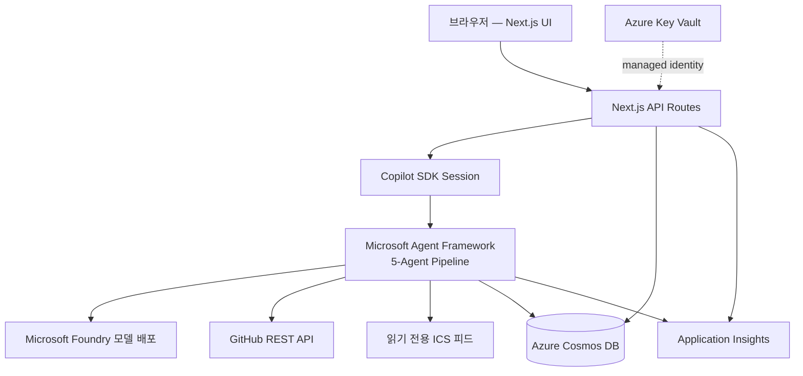

# TRD — First Move

> PRD의 기능 요구사항을 구현하기 위한 기술 설계 문서

| 항목 | 내용 |
| --- | --- |
| 문서 버전 | 1.0 |
| 기준 문서 | [PRD.md](PRD.md), [mata/IDEATION_FINAL.md](mata/IDEATION_FINAL.md) |

## 1. 시스템 아키텍처



- 단일 Azure App Service에 Next.js 앱(UI + API Routes)을 배포한다.
- 에이전트 오케스트레이션은 Next.js 서버 사이드 모듈로 실행하고, 진행 이벤트는 SSE로 브라우저에 스트리밍한다.
- 추론은 Microsoft Foundry 모델 배포로 통일한다.

## 2. 기술 스택

| 계층 | 기술 | 비고 |
| --- | --- | --- |
| 프론트엔드 | Next.js 16 (App Router), React 19, TypeScript | 현재 저장소 구성 유지 |
| 런타임 | Node.js ≥ 20.9 | `package.json` engines |
| 에이전트 세션·도구 | GitHub Copilot SDK (TypeScript) | 인터페이스 계층 — 세션 관리, 도구 정의·호출, SSE 스트리밍 |
| 오케스트레이션 | Microsoft Agent Framework | 오케스트레이션 계층 — 5개 에이전트 워크플로 그래프, fan-out, 상태 전이 |
| 추론 | Microsoft Foundry 모델 배포 | 구조화 출력 (JSON Schema) |
| 저장소 | Azure Cosmos DB (NoSQL) | 실행 계약·영수증·측정 이벤트 |
| 비밀 관리 | Azure Key Vault + managed identity | OAuth 클라이언트 시크릿·토큰 암호화 키·HMAC 서명 키 |
| 관측 | Application Insights | `executionId` 단일 trace |
| 스키마 검증 | zod → JSON Schema | 에이전트 간 계약 검증 |

Copilot SDK는 사용자 대면 세션·도구·스트리밍을, Agent Framework는 에이전트 간 워크플로 그래프와 상태 전이를 담당한다. 두 계층은 별도 코드 모듈로 분리해 각각의 활용 증거를 저장소에서 확인할 수 있게 한다.

## 3. 에이전트 파이프라인

```text
Scout(병렬) → Compiler → Policy → 사용자 승인 → Executor → Verifier
```

| 에이전트 | 책임 | 입력 | 구조화 출력 |
| --- | --- | --- | --- |
| Scout Agent | 밤사이 GitHub 변경(커밋·이슈 댓글·리뷰 요청)과 ICS 일정 병렬 수집 | `repoRef`, `icsUrl` | `OvernightDiff` |
| Compiler Agent | 실행 계약과 우선 행동 3개 컴파일, 근거 링크 연결 | `OvernightDiff` | `ExecutionContract` |
| Policy Agent | 금지 범위·권한·프롬프트 인젝션 검사 | `ExecutionContract` | `PolicyReport` |
| Executor Agent | 승인 토큰이 있는 노드만 실행 (할 일 생성, 코멘트 초안) | `ApprovalToken` | `ExecutionResult` |
| Verifier Agent | 결정적 규칙으로 성공 조건 검증 | `ExecutionResult` | `EvidenceReceipt` |

### 3.1 오케스트레이션 규칙

- Scout의 GitHub·ICS 수집은 fan-out으로 병렬 실행하고 trace에 남긴다.
- 에이전트 간 데이터는 zod 스키마로 검증하며 자유 형식 전달을 금지한다.
- Policy 검사를 통과하지 못한 노드는 승인 목록에 노출하지 않는다.
- 이슈·PR 본문은 신뢰하지 않는 데이터로 태깅해 시스템 프롬프트와 분리한다.
- Verifier 실패 시 자동 성공 처리를 금지하고 실패 노드만 수동 재시도를 허용한다.
- 모든 단계는 하나의 `executionId`로 연결한다.

### 3.2 에이전트 도구 정의

사용자 대면 Copilot SDK 앱 도구(`start_day`, `approve_execution` 등)는 [AGENTS.md](AGENTS.md) 5장을 따른다. 아래는 에이전트가 내부에서 호출하는 도구다.

| 도구 | 종류 | 설명 |
| --- | --- | --- |
| `github.list_commits` | 읽기 | 최근 24시간 커밋 조회 |
| `github.list_issue_events` | 읽기 | 이슈 댓글 조회 |
| `github.list_review_requests` | 읽기 | 리뷰 요청 조회 |
| `calendar.read_ics` | 읽기 | ICS 파싱으로 오늘 일정·가용 시간 계산 |
| `github.create_todo_issue` | 쓰기 | 연결된 GitHub 저장소에 `first-move` 라벨 이슈로 할 일 생성 (승인 토큰 필수) |
| `drafts.save_issue_comment` | 쓰기 | 이슈 코멘트 초안을 Cosmos DB에 저장, GitHub에 게시하지 않음 (승인 토큰 필수) |
| `verify_receipt` | 읽기 | Verifier 규칙 실행과 영수증 발급 |

쓰기 도구는 유효한 `ApprovalToken` 없이 호출되면 403을 반환한다.

## 4. API 설계

| 메서드·경로 | 설명 |
| --- | --- |
| `POST /api/executions` | 하루 시작 — 새 `executionId` 발급, Scout→Compiler→Policy 실행 |
| `GET /api/executions/:id/stream` | SSE — 에이전트 진행 이벤트 스트리밍 |
| `GET /api/executions/:id` | 실행 계약·상태 조회 (새로고침 복원) |
| `POST /api/executions/:id/approve` | 노드 선택·제외를 담은 승인, `ApprovalToken` 발급 후 Executor 실행 |
| `POST /api/executions/:id/retry/:nodeId` | 실패 노드만 재시도 |
| `GET /api/executions/:id/receipt` | 증거 영수증 조회 |
| `GET /api/metrics/daily` | 일별 시동 시간·절약 시간 대시보드 데이터 |
| `POST /api/judge` | Judge Mode — 공개 저장소 URL로 읽기 전용 즉석 실행 |
| `GET /api/health` | 상태 엔드포인트 |

## 5. 데이터 모델 (Cosmos DB)

컨테이너: `executions` (partition key: `/userId`), `metrics` (partition key: `/userId`)

```text
Execution (id = executionId)
├── userId, repoRef, mode: "daily" | "judge"
├── status: created | scouting | compiling | policy_check | waiting_approval
│           | executing | verifying | completed | failed | rejected | expired  (AGENTS.md 3장과 동일)
├── overnightDiff: OvernightDiff
├── contract: ExecutionContract
│   ├── actions[3]: { nodeId, title, evidenceUrls[], successCriteria, forbidden[] }
│   └── contractHash
├── policyReport: { findings[], blockedNodes[] }
├── approval: { token, approvedNodeIds[], approvedHash, excludedNodes[], expiresAt }
├── executionResult: { nodes[]: { nodeId, toolCall, resultRef, idempotencyKey, status } }
├── receipt: EvidenceReceipt
│   ├── rules[]: { name, passed, evidence }
│   ├── startupSeconds, savedMinutes
│   └── issuedAt
└── traceId

MetricEvent (id = eventId)
├── userId, executionId, date
├── name: button_clicked | approval_completed | first_action_done | screen_viewed | ...
├── value, source
└── recordedAt
```

- 멱등성: 쓰기 노드는 `executionId + nodeId` 기반 idempotency key로 중복 생성을 방지한다.
- Judge Mode 실행은 `mode: "judge"`, `userId: "judge"`로 저장하고 쓰기 도구를 비활성화하며, 쓰기 노드는 드라이런 미리보기까지만 진행한다.

## 6. 외부 연동

### 6.1 GitHub

- 인증: 로그인 시 발급된 사용자별 GitHub OAuth 액세스 토큰을 그대로 API 호출에 사용한다 (별도 PAT 불요). 스코프는 Issues R/W, Contents/PR Read 수준으로 최소화.
- 수집: `since` 파라미터로 최근 24시간 필터, ETag 조건부 요청과 인메모리 캐시로 속도 제한 대응.
- Judge Mode: 서버가 보관하는 읽기 전용 토큰(Key Vault)으로 공개 저장소를 조회해 무인증 속도 제한(시간당 60회)을 회피하고, 쓰기 API를 호출하지 않는다.

### 6.2 캘린더

- 읽기 전용 ICS URL을 파싱해 오늘 일정과 가용 시간 블록을 계산한다. 양방향 연동은 하지 않는다.
- ICS 미입력 시(Judge Mode 포함) "일정 없음"으로 처리하고 계획 컴파일은 정상 진행한다.

## 7. 보안 설계

- **사용자 인증:** GitHub OAuth 로그인으로 `userId`를 확정하고 서명된 세션 쿠키를 사용한다. OAuth 액세스 토큰이 유일한 GitHub 자격 증명이며, Key Vault의 암호화 키로 암호화해 서버 측(Cosmos DB)에 보관하고 클라이언트에 노출하지 않는다. Judge Mode는 로그인 없이 읽기 전용으로만 동작한다.
- **승인 토큰:** `{ executionId, approvedNodeIds, approvedHash, allowedTools, issuedAt, expiresAt }`를 서버 서명(HMAC)으로 발급 (AGENTS.md 6장과 동일 계약). 만료 10분, 해시 불일치·허용 외 도구 요청 시 실행 거부.
- **승인 전 읽기 전용:** 쓰기 도구는 토큰 검증 미들웨어를 거치며 위반 시 403과 감사 로그를 남긴다.
- **프롬프트 인젝션 격리:** 이슈·PR 본문은 `untrusted_content` 블록으로 래핑해 모델에 전달하고, Policy Agent가 지시문 패턴을 검사해 의심 노드를 차단한다.
- **비밀 관리:** OAuth 클라이언트 시크릿·토큰 암호화 키·HMAC 서명 키·Judge Mode 읽기 전용 토큰은 Key Vault, App Service는 managed identity로 접근. 코드·로그·클라이언트에 비밀 미노출.
- **최소 권한:** Cosmos DB·Key Vault RBAC를 App Service managed identity에만 부여한다.

## 8. Verifier 규칙 (결정적)

| 규칙 | 검사 방법 | 실패 시 |
| --- | --- | --- |
| 근거 URL 실존 | GitHub 리소스는 사용자 OAuth 토큰으로 인증된 API 재조회, 그 외 URL은 HEAD/GET 2xx 확인 (비공개 저장소 404 오탐 방지) | 해당 행동 실패 표시 |
| 생성물 실존 | 할 일은 GitHub Issues API, 코멘트 초안은 자체 실행 API로 재조회 | 노드 실패, 재시도 허용 |
| 금지 행동 부재 | 도구 호출 로그에 금지 범위 API 호출 없음 확인 | 영수증에 위반 기록 |
| 승인 해시 일치 | 실행된 노드 해시가 승인 해시와 동일한지 비교 | 실행 결과 거부 |
| 90초 타이머 | `button_clicked`→`approval_completed` 이벤트 시간 계산, 90초 이하면 통과 | 규칙 실패로 표시하되 실행 결과는 무효화하지 않고 실측값을 영수증에 기록 |

LLM 판단을 사용하지 않으며 모든 규칙은 코드로 실행한다.

Judge Mode는 승인 단계가 없으므로 수집 완료·실행 계약 컴파일·근거 URL 실존·금지 행동 부재(쓰기 API 호출 없음)만 검사하고, 승인 해시 일치·90초 타이머는 검사 대상에서 제외하며 영수증에 검사 범위를 명시한다.

## 9. 관측성

- 모든 요청·에이전트 실행·도구 호출에 `executionId`를 전파해 Application Insights에서 단일 trace로 조회한다.
- 커스텀 이벤트: `agent_started`, `tool_called`, `approval_granted`, `write_blocked`, `verifier_rule_result`.
- 로그에는 URL·ID·해시만 기록하고 본문 전문·비밀·개인정보를 기록하지 않는다.

## 10. Azure 리소스 구성

| 리소스 | SKU/구성 | 용도 |
| --- | --- | --- |
| App Service | Linux, Node 20, B1 이상 | Next.js 앱·API 호스팅 |
| Microsoft Foundry | 모델 배포 1개 (구조화 출력 지원 모델) | 에이전트 추론 |
| Cosmos DB | NoSQL, serverless | 실행·측정 데이터 |
| Key Vault | Standard | OAuth 클라이언트 시크릿, 토큰 암호화 키, HMAC 서명 키, Judge Mode 읽기 전용 토큰 |
| Application Insights | workspace 기반 | trace·이벤트 |

모든 리소스는 Bicep 템플릿(`infra/`)으로 정의해 저장소에 포함하고 azd로 프로비저닝한다. 배포는 GitHub Actions로 `main` push 시 App Service에 자동 배포한다.

## 11. 오류 처리와 신뢰성

- 에이전트·외부 호출별 타임아웃 (GitHub 10초, 추론 30초, 전체 파이프라인 120초).
- 읽기 호출만 지수 백오프로 최대 2회 재시도, 쓰기는 재시도 대신 멱등성 키로 보호.
- 부분 실패 시 성공한 노드 결과는 유지하고 실패 노드만 UI에 재시도 버튼을 노출한다.
- 데모 대비: 직전 성공 실행의 영수증·trace 스냅샷을 읽기 전용으로 재생할 수 있다.

## 12. 테스트 전략

| 종류 | 대상 |
| --- | --- |
| 단위 | Verifier 규칙, 승인 토큰 검증, ICS 파서, 멱등성 키 |
| 통합 | 승인 없는 쓰기 403, 인젝션 노드 차단, 중복 실행 시 단일 생성 |
| E2E | 하루 시작→영수증 정상 경로, 실패 노드 재시도 경로, Judge Mode |
| 수동 | 미리 보지 않은 공개 저장소 3개로 Judge Mode 리허설 |

### 첫 번째 구현 게이트

아래가 통과되기 전에는 기능을 추가하지 않는다.

- 승인 없는 쓰기 요청이 403으로 차단된다.
- 근거 URL이 없는 행동이 Verifier에서 실패한다.
- 실행 계약을 저장하고 새로고침 후 동일한 해시로 복원한다.
- 정상 실행과 실패 실행이 각각 하나의 trace로 연결된다.

### 심사 증거 체크리스트 (SCORING 대응)

문서상 설계만으로는 배점의 40%를 초과할 수 없으므로, 아래 증거를 해당 마일스톤에서 확보한다.

| 영역 | 조치 | 시점 |
| --- | --- | --- |
| AGENT1 (25점) | Copilot SDK 계층과 Agent Framework 계층을 별도 디렉터리(예: `lib/copilot/`, `lib/workflow/`)로 분리해 저장소 구조 자체가 "단순 호출을 넘는 활용" 증거가 되게 한다 | M1 |
| AGENT2 (18점) | `evidence_link_rate`를 포함한 4종 지표 계산 로직을 M1에서 함께 구현하고, 첫날 수동 기준값 실측과 동시에 일별 축적을 시작한다 — M4로 미루면 심사 시점 20회 표본이 붕괴한다 | M1 |
| AGENT3 (18점) | 배포 직후 Application Insights 단일 trace 조회 화면, Azure 리소스 목록, Cosmos DB 문서 조회 결과를 제출물에 포함해 "실행 증거 없음 시 최대 7.2점" 제한을 회피한다 | M2 |

## 13. 참고 문서

- 제품 요구사항: [PRD.md](PRD.md)
- 최종 아이디어: [mata/IDEATION_FINAL.md](mata/IDEATION_FINAL.md)
- 채점 규정: [SCORING.md](SCORING.md)
