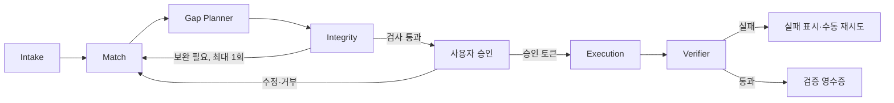
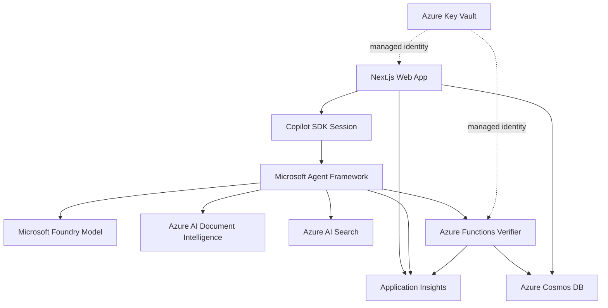

# 최종 아이디어: CareerCompass

> 채용 공고를 실제 경험 증거와 7일 준비 행동으로 컴파일하는 취업 준비 에이전트

## 1. 한 줄 요약

채용 공고와 사용자의 경험 카드를 대조해 **요건별 근거·증거 공백·확인 질문**을 만들고, 사용자가 승인한 내용만 7일 준비 계획과 면접 카드로 실행한 뒤 근거 없는 경력이 없는지 결정적으로 검증하는 웹 앱.

## 2. 문제 정의

### 대상 사용자

첫 취업, 직무 전환, 이직을 준비하지만 공고마다 요구 조건이 달라 무엇부터 준비해야 할지 막막한 20~30대.

### 반복적이고 측정 가능한 문제

지원자는 공고 하나를 검토할 때 다음 작업을 반복한다.

- 긴 공고에서 필수 조건, 우대 조건, 실제 업무를 구분한다.
- 각 조건에 맞는 프로젝트, 아르바이트, 학습 경험을 다시 찾는다.
- 근거가 약한 조건과 면접에서 확인할 질문을 정리한다.
- 지원 전에 보완할 행동의 순서와 기한을 정한다.
- 자기소개서나 면접 답변에 과장된 내용이 없는지 다시 검사한다.

일반적인 생성형 도구는 매끄러운 문장을 만들지만, 사용자가 제공하지 않은 경력이나 수치를 섞을 수 있다. 반대로 단순 키워드 매칭은 경험의 맥락과 전이 가능한 역량을 이해하지 못한다.

### 문제 문장

**20~30대 구직자가 채용 공고 한 건을 실제 경험과 대조해 지원 준비 계획으로 바꾸는 반복 작업은 오래 걸리고, 근거 누락과 경력 과장의 위험이 있다.**

### 해결 가설

공고 요건과 사용자의 경험을 구조화하고 모든 주장에 `experienceId`를 연결한 뒤, 증거가 없는 항목은 문장 생성 대신 준비 행동으로 전환하면 공고 분석 시간을 줄이면서 근거 없는 주장 수를 0건으로 유지할 수 있다.

## 3. 핵심 사용자 흐름

```text
수집
  채용 공고 1건 + 경험 카드 8개 불러오기
    ↓
계획
  요건 분해 + 경험 증거 매칭 + 증거 공백 식별
    ↓
안전 검사
  경력 창작·민감정보·편향 표현·외부 문서 지시 검사
    ↓
사용자 승인
  요건별 연결을 수정·승인·거부하고 실행 범위 확정
    ↓
실행
  승인된 연결만 7일 준비 계획과 면접 카드로 저장·내보내기
    ↓
검증
  모든 주장에 실제 experienceId가 있는지 결정적으로 검사
```

### 사용자 조작

1. `샘플로 시작`을 눌러 공고와 경험 카드를 불러온다.
2. 에이전트가 만든 요건-경험 매트릭스에서 연결을 수정하고 승인한다.
3. 승인된 결과로 생성된 7일 계획과 검증 영수증을 확인한다.

승인 전에는 Cosmos DB 저장, PDF 생성, 외부 쓰기를 실행하지 않는다. 분석 중간 상태는 세션 메모리에만 보관하며, 사용자가 승인한 구조화 데이터만 저장한다.

## 4. 에이전트 설계

### Copilot SDK의 핵심 역할

Copilot SDK는 장식용 채팅이 아니라 사용자 세션과 실제 도구 상호작용을 담당한다.

- 공고·경험 카드 컨텍스트를 유지하는 지속 세션
- 공고 파싱, 경험 검색, 연결 수정, 계획 저장, PDF 내보내기 도구 호출
- 요건별 근거를 묻는 후속 대화와 구조화 출력
- Agent Framework의 단계별 진행 이벤트를 UI로 스트리밍
- 승인 토큰이 있는 경우에만 쓰기 도구 호출

### Microsoft Agent Framework 오케스트레이션

| 에이전트 | 책임 | 입력 | 구조화 출력 |
| --- | --- | --- | --- |
| Intake Agent | 공고와 경험 카드를 정규화하고 외부 지시를 데이터로 격리 | 공고, 경험 카드 | `JobRequirement[]`, `Experience[]` |
| Match Agent | 필수·우대 조건별 후보 경험을 병렬 검색 | 정규화 데이터 | `EvidenceMatch[]` |
| Gap Planner Agent | 증거 공백을 7일 안에 가능한 준비 행동으로 전환 | 매칭 결과 | `GapAction[]` |
| Integrity Agent | 경력 창작, 과장 수치, 민감정보, 편향 표현 검사 | 매칭과 계획 | `IntegrityFinding[]` |
| Execution Agent | 승인된 연결만 저장하고 면접 카드·계획 생성 | 승인 토큰 | `ExecutionResult` |
| Verifier Agent | 실제 저장 결과와 결정적 규칙을 대조 | 실행 결과 | `VerificationReceipt` |

### 상태 전이



### 오케스트레이션 규칙

- 에이전트 간 데이터는 JSON Schema로 검증하며 자유 형식 전달을 금지한다.
- 공고의 문구는 분석 대상 데이터로 취급하고 도구 명령으로 실행하지 않는다.
- Integrity Agent를 통과하지 못한 항목은 승인 목록에 노출하지 않는다.
- 승인 토큰에는 `executionId`, 허용 도구, 승인 항목 해시, 만료 시각을 포함한다.
- Verifier 실패 시 자동으로 성공 처리하거나 전체 작업을 반복하지 않는다.

## 5. 100점을 만드는 핵심 장치

### 5.1 Evidence Lock

모든 강점과 면접 답변 포인트는 사용자가 입력한 경험 카드의 `experienceId`를 하나 이상 가져야 한다. 연결할 경험이 없으면 문장을 생성하지 않고 `증거 공백`으로 표시한다.

### 5.2 No-Fiction Verifier

LLM이 아닌 결정적 코드로 다음을 검사한다.

- 생성된 모든 주장에 유효한 `experienceId`가 있는가
- 경험 카드에 없는 조직명, 기간, 역할, 수치가 추가되지 않았는가
- 필수 조건별 상태가 `근거 있음`, `보완 필요`, `사용자 확인` 중 하나인가
- 승인하지 않은 항목이 저장 또는 PDF에 포함되지 않았는가
- 저장된 계획을 다시 읽었을 때 승인 항목 해시가 같은가

### 5.3 Blind Challenge Mode

심사위원이 샘플 공고의 요구 조건 하나를 수정하거나 새로운 경험 카드 하나를 추가하면 해당 조건만 재분석한다. 결과 매트릭스, 준비 행동, 검증 영수증이 즉시 달라져 하드코딩이 아님을 보여준다.

### 5.4 Evidence Receipt

자연어 완료 메시지 대신 다음 내용을 포함한 영수증을 발급한다.

- 요건별 근거 연결과 원문 위치
- 사용자 승인·수정·거부 이력
- 실행한 도구와 저장 결과
- 결정적 검증 규칙별 통과·실패
- 걸린 시간과 생산성 측정 원본 이벤트
- 실행하지 않은 금지 행동

### 5.5 단일 완결 루프

자기소개서 전체 생성, 채용 사이트 연동, 자동 지원을 넓게 구현하지 않는다. `공고 1건 → 경험 증거 매칭 → 승인 → 7일 계획 → 검증` 한 경로를 실제 Azure 환경에서 끝까지 완성한다.

## 6. Azure 아키텍처

Azure는 배포 이름표가 아니라 문서 이해, 근거 검색, 상태 복원, 관측에 직접 기여한다.



| Azure 서비스 | 제품 핵심 역할 | 라이브 증거 |
| --- | --- | --- |
| Azure App Service | Next.js 웹 앱과 API 호스팅 | 공개 데모 URL과 상태 엔드포인트 |
| Microsoft Foundry 모델 배포 | Agent Framework 에이전트의 구조화 추론 | 모델 배포 정보와 요청 추적 ID |
| Azure AI Document Intelligence | PDF 공고와 이력서의 섹션·표 추출 | 원문 위치가 포함된 추출 JSON |
| Azure AI Search | 공고 요건과 경험 카드의 근거 검색 | 검색 점수, 문서 ID, 근거 위치 |
| Azure Functions | No-Fiction 검증과 PDF 생성 | 규칙별 검증 응답과 invocation ID |
| Azure Cosmos DB | 승인 매트릭스, 계획, 영수증, 측정 이벤트 저장 | 새로고침 후 복원과 문서 ID |
| Azure Key Vault | 자격 증명과 비밀 관리 | managed identity 구성과 비밀 미노출 |
| Application Insights | `executionId` 기준 end-to-end 관측 | 에이전트·도구·Azure 호출 단일 trace |

### 핵심 데이터 모델

```text
CareerSession (partition key: sessionId)
├── JobRequirement[]
├── Experience[]
├── EvidenceMatch[]
├── GapAction[]
├── ApprovalEvent[]
├── ExecutionResult
├── VerificationReceipt
└── MetricEvent[]
```

MVP 샘플 모드는 합성 데이터만 사용한다. 사용자 파일 모드가 추가되면 원본은 짧은 만료 정책을 적용하고, 구조화에 필요하지 않은 이름·연락처·주소는 저장 전에 제거한다.

## 7. MVP 범위

### 반드시 구현

- 로그인 없는 샘플 공고 2개와 합성 경험 카드 8개
- PDF 또는 텍스트 공고 불러오기
- 필수·우대·업무 요건 구조화
- 요건별 경험 검색과 근거 위치 표시
- `근거 있음`, `보완 필요`, `사용자 확인` 상태
- 사용자의 연결 수정·승인·거부
- 승인 전 쓰기 차단과 승인 토큰
- 7일 준비 계획과 면접 카드 생성
- No-Fiction 결정적 검증과 증거 영수증
- Blind Challenge Mode
- Cosmos DB 저장·복원, App Service 배포, Application Insights trace

### 시간이 남으면 추가

- 사용자가 직접 만든 경험 카드 저장
- 공고 두 건 비교 보기
- 준비 행동 완료 체크와 재계획
- 한국어·영어 면접 카드 전환

### 명시적 비범위

- 합격 가능성, 지원자 점수, 다른 지원자와의 순위
- 자기소개서 전체 자동 작성과 경력·수치 보강
- 채용 사이트 로그인, 자동 지원, 이메일 전송
- 얼굴, 나이, 성별, 출신지 등 민감 특성 기반 추천
- 기업의 채용 결정이나 지원자 선별 기능
- 임의 웹 크롤링과 외부 채용 공고 수집

## 8. 생산성 측정

검증되지 않은 수치를 사실처럼 제시하지 않는다. 아래 기준값은 **실측 예정**이며 해커톤 첫날 동일 샘플로 확정한다.

| 지표 | 기준값 | MVP 목표 | 측정 시점 | 저장할 원본 이벤트 |
| --- | --- | --- | --- | --- |
| 요건 분해 완료 시간 | 실측 예정 | 기준 대비 70% 단축 | 공고 열기 → 요건 확정 | `job_opened`, `requirements_approved` |
| 경험 근거 연결 시간 | 실측 예정 | 기준 대비 60% 단축 | 요건 확정 → 매칭 승인 | `matching_started`, `matching_approved` |
| 놓친 필수 조건 수 | 실측 예정 | 0건 | 최종 매트릭스 확정 | 조건별 수동 정답 대조 |
| 근거 없는 주장 수 | 실측 예정 | 0건 | Verifier 완료 | 규칙별 실패 이벤트 |
| 준비 계획 작성 단계 | 실측 예정 | 3단계 이하 | 샘플 시작 → 계획 저장 | 클라이언트 행동 이벤트 |
| 근거 연결률 | 실측 예정 | 100% | 영수증 발급 | 유효 `experienceId` 비율 |

### 실험 방법

1. 필수 조건 6개와 우대 조건 4개의 정답표가 있는 합성 공고를 준비한다.
2. 참가자는 공고와 경험 카드로 요건 표와 7일 준비 계획을 수작업 작성한다.
3. 같은 참가자가 CareerCompass로 같은 결과를 만든다. 순서 효과를 줄이기 위해 샘플 A/B 순서를 교차한다.
4. 시간, 조작 단계, 누락 조건, 근거 없는 주장을 원본 이벤트와 정답표로 계산한다.
5. 최소 10회 수행을 목표로 하되 실제 완료 횟수만 화면과 발표 자료에 표시한다.
6. 계산식과 익명화한 원본 이벤트를 저장소에 포함해 결과를 재현할 수 있게 한다.

### 계산식

$$
\text{시간 단축률}(\%) = \frac{\text{수동 소요 시간} - \text{CareerCompass 소요 시간}}{\text{수동 소요 시간}} \times 100
$$

$$
\text{근거 연결률}(\%) = \frac{\text{유효한 experienceId가 있는 주장 수}}{\text{전체 주장 수}} \times 100
$$

## 9. 책임 있는 AI·보안·신뢰성

### 책임 있는 AI

- 모든 AI 제안에 AI 생성 표시와 경험 카드 근거를 함께 보여준다.
- `합격 가능`, `부적합 인재`처럼 채용 결과를 단정하지 않는다.
- 증거가 없는 조건은 약점을 꾸며내지 않고 `보완 필요`로 표시한다.
- 보호 특성과 민감정보를 매칭·계획 입력에서 제외한다.
- 사용자는 모든 연결을 수정, 거부, 삭제할 수 있다.

### 보안

- 공고의 지시문은 신뢰하지 않는 데이터로 격리해 프롬프트 인젝션을 차단한다.
- 입력과 도구 인자는 JSON Schema와 허용 목록으로 검증한다.
- 승인 토큰 없이 Cosmos DB 쓰기와 PDF 생성을 거부한다.
- Azure 자격 증명은 Key Vault와 managed identity로 관리한다.
- 로그에 공고 원문, 경험 본문, 비밀, 개인식별정보를 기록하지 않는다.
- 사용자 데이터 삭제 시 관련 세션과 파생 산출물을 함께 삭제한다.

### 신뢰성

- 각 에이전트와 외부 호출에 타임아웃을 두고 실패 단계를 UI에 표시한다.
- 읽기 호출만 제한적으로 재시도하며 쓰기는 멱등성 키로 중복 생성을 막는다.
- Document Intelligence 또는 Search 실패 시 부분 결과를 성공처럼 표시하지 않는다.
- 실패 노드만 사용자가 재시도할 수 있고 이전 승인 범위를 자동 확대하지 않는다.
- 모든 호출을 하나의 `executionId` trace로 연결한다.

### 결정적 안전 검사

| 검사 | 실패 시 동작 |
| --- | --- |
| 유효하지 않은 `experienceId` | 해당 주장 제거 후 승인 취소 |
| 경험에 없는 수치·기간·조직명 | 실행 차단, 원문 비교 표시 |
| 승인 해시 불일치 | 저장·내보내기 거부 |
| 금지된 민감 속성 발견 | 필드 마스킹 후 사용자 확인 |
| 중복 `executionId` 쓰기 | 기존 결과 반환 |
| Azure 호출 타임아웃 | 실패 상태와 수동 재시도 표시 |

## 10. 항목별 만점 게이트

아래 표는 예상 획득 점수가 아니라 각 항목에서 만점을 받기 위해 구현해야 할 게이트다.

| 평가 영역 | 배점 | 만점 게이트 | 심사 증거 |
| --- | ---: | --- | --- |
| AGENT1 Copilot SDK 및 Agent Framework | 25 | SDK가 실제 도구를 호출하고 6개 에이전트의 병렬·분기·승인·검증을 수행 | 세션 코드, 도구 호출 로그, 상태 전이 UI, 단일 trace |
| AGENT2 생산성 향상 및 문제 적합성 | 18 | 동일 샘플의 수동/도구 비교를 실제 수행하고 원본 이벤트로 재계산 가능 | 실측 대시보드, 정답표, 익명 이벤트, 계산식 |
| AGENT3 Azure 클라우드 연동 | 18 | 문서 추출·검색·검증·저장·관측이 실제 Azure 리소스에서 동작 | 배포 URL, 추출 JSON, Search 결과, Cosmos 복원, trace |
| AGENT4 기능 완성도 및 기술 구현 | 16 | 수집부터 검증까지 E2E 동작하고 정상·실패·멱등 테스트 통과 | 라이브 데모, 테스트 결과, Blind Challenge Mode |
| AGENT5 사용자 경험 및 워크플로 설계 | 12 | 샘플 시작→매칭 승인→영수증의 3단계 흐름과 명확한 상태·오류 표시 | 모바일·데스크톱 화면, 접근성 검사, 오류 복구 UI |
| AGENT6 책임 있는 AI·보안·신뢰성 | 6 | 경력 창작 차단, 최소 권한, 인젝션 격리, 승인 토큰, 멱등성 시연 | 차단 데모, 검증 규칙, Key Vault 구성, 실패 trace |
| AGENT7 혁신성 및 독창성 | 5 | 생성기가 아닌 Evidence Lock·증거 공백 행동화·결정적 영수증을 구현 | 요건-증거 매트릭스, 수정 전후 diff, 검증 영수증 |
| **합계** | **100** | | |

설명만 있고 위 증거가 실행 화면, 코드, 리소스 또는 테스트에서 확인되지 않으면 해당 항목은 최대 배점의 40%를 넘기기 어렵다.

## 11. 3분 데모

| 시간 | 장면 | 확인할 점수 증거 |
| ---: | --- | --- |
| 0:00~0:20 | 수작업 기준값과 문제 제시 | A2 문제 적합성과 실측 계획 |
| 0:20~0:40 | 로그인 없이 샘플 공고·경험 카드 불러오기 | A5 진입성과 A4 실행 가능성 |
| 0:40~1:10 | Intake·Match 병렬 실행과 실제 도구 호출 스트리밍 | A1 SDK·Framework, A3 Azure 호출 |
| 1:10~1:35 | 요건-경험 매트릭스에서 근거 열기, 한 연결 수정 | A5 UX와 A7 Evidence Lock |
| 1:35~1:55 | 경력 수치 창작 시도를 Integrity Agent가 차단 | A6 책임 있는 AI와 인젝션 격리 |
| 1:55~2:15 | 승인 후 7일 계획 저장·PDF 생성 | A4 완결 흐름과 승인 게이트 |
| 2:15~2:35 | No-Fiction 검증 영수증과 Cosmos 새로고침 복원 | A3 저장, A4 검증, A6 멱등성 |
| 2:35~2:50 | 공고 조건 하나를 바꾸는 Blind Challenge Mode | A7 독창성과 하드코딩 방지 |
| 2:50~3:00 | Application Insights의 `executionId` 단일 trace | A3 운영성과 A6 신뢰성 |

네트워크 장애에 대비해 직전 성공 실행의 읽기 전용 영수증과 trace 스냅샷을 준비하되, 라이브 실행과 녹화 결과를 명확히 구분한다.

## 12. 리스크와 대응

| 리스크 | 영향 | 대응 |
| --- | --- | --- |
| Copilot SDK와 Agent Framework 통합 범위가 큼 | 핵심 경로 미완성 | 공고 1건·경험 카드 8개·쓰기 도구 2개로 고정하고 세로 흐름부터 완성 |
| PDF 형식 편차 | 요건 추출 실패 | 데모 PDF 2개를 고정하고 원문 텍스트 입력 폴백 제공 |
| AI가 경험을 과대 해석 | 사용자 신뢰 하락 | Evidence Lock, Integrity Agent, 결정적 필드 비교로 실행 차단 |
| 채용 적합도 점수로 오해 | 편향·차별 위험 | 사람 평가와 순위를 비범위로 명시하고 증거 상태만 표시 |
| Azure 서비스 지연·오류 | 3분 데모 중단 | 단계별 타임아웃, 부분 실패 표시, 실패 노드 수동 재시도 |
| 실측 횟수 부족 | A2 증거 약화 | 목표와 실제 횟수를 분리 표시하고 원본 이벤트·계산식을 공개 |
| 개인정보 노출 | 보안 항목 치명적 감점 | 합성 데이터 기본값, 민감 필드 제거, 최소 보존, 일괄 삭제 |
| 재시도로 중복 저장 | 결과 불일치 | `executionId` 기반 멱등성 키와 승인 해시 검증 |

## 13. 구현 순서

1. **결정적 세로 흐름:** 합성 JSON으로 요건 분해 → 매칭 → 승인 → 저장 → 검증을 먼저 완성한다.
2. **Copilot SDK 도구:** 공고 읽기, 경험 검색, 연결 수정, 계획 저장, PDF 내보내기를 실제 호출로 연결한다.
3. **Agent Framework:** 6개 에이전트의 구조화 전달, 병렬 매칭, Integrity 반환 분기, 승인 게이트를 구현한다.
4. **Azure 증거:** Cosmos DB와 Application Insights를 초기부터 연결해 모든 실행에 증거가 남게 한다.
5. **문서 입력:** Document Intelligence와 AI Search를 연결하고 텍스트 폴백을 유지한다.
6. **안전·실패:** 경력 창작, 인젝션, 승인 해시 불일치, 타임아웃, 중복 실행 테스트를 추가한다.
7. **생산성 측정:** 원본 이벤트와 정답표 기반 A/B 측정 대시보드를 구현한다.
8. **Blind Challenge Mode:** 공고 조건·경험 카드 변경 시 영향받은 결과만 재실행한다.
9. **UI 완성:** 모바일·데스크톱에서 매트릭스, 근거 패널, 진행 상태, 오류 복구를 검증한다.
10. **제출 준비:** 3분 데모 리허설, README, 아키텍처, 제한사항, 테스트 결과를 정리한다.

### 첫 번째 구현 게이트

아래 조건이 통과되기 전에는 기능을 추가하지 않는다.

- 승인 없는 쓰기 요청이 403으로 차단된다.
- 경험 카드에 없는 수치를 포함한 주장이 Verifier에서 실패한다.
- 승인된 매트릭스를 저장하고 새로고침 후 동일한 해시로 복원한다.
- 정상 실행과 실패 실행이 각각 하나의 trace로 연결된다.

## 14. 참고 문서

- 채점 규정: [SCORING.md](../SCORING.md)
- `CareerCompass` 후보 원문: [kh/IDEATION.md](../kh/IDEATION.md)
- 다른 팀 후보 비교 문서: [IDEATION.md](./IDEATION.md)
- 제품 요구사항: [PRD.md](../PRD.md) — 현재 비어 있어 제약을 반영하지 않음
- 기술 요구사항: [TRD.md](../TRD.md) — 현재 비어 있어 제약을 반영하지 않음
